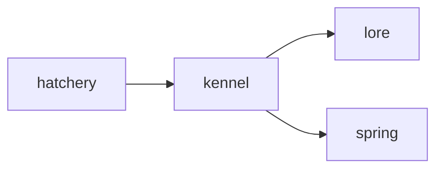

# Kennel

**Breeder Hub** — Web calculator tracking genetic mechanics for pet breeding across the 210 kinds.

Part of [ComputerPets](https://github.com/RicheyWorks/computerpets). Map: [computerpets-ecosystem](https://github.com/RicheyWorks/computerpets-ecosystem).

| | |
| --- | --- |
| Status | Design scaffold — contract frozen, implementation next |
| License | MIT |
| First pet | Still [Rui on the desktop](https://github.com/RicheyWorks/computerpets/blob/main/docs/START-HERE.md). This organ is optional. |

## The job

Lineages matter. Kennel shows what two pets can produce, what is canon-illegal (panda × fish), and the rarity of a whelp before anyone mints it.

The flagship overlay already puts a living sticker on the real desktop (Rui first, 210 kinds). Kennel does not replace that. It is one organ.

## Who uses it

Breeders and Hatchery. Calculator, not a slot machine.

## What it is not

Not a place to invent species. Panda × fish is a documented no.

## Architecture



## Stack

TypeScript · React 19 · Vite · genetic calculator · Spring lineage API

GroupId / namespace: `com.enterprisepet.kennel`  
Default listen: `8080`

## Contract

### Data

`Pairing(a, b, legal) · WhelpRow(trait, p) · Lineage(nodes[], coeff)`

### Surface

- POST /v1/predict — two petIds → whelp table + illegal flag
- GET /v1/lineage/{petId} — ancestors, generation, inbreeding coeff
- GET /v1/species-matrix — who can breed with whom

### Failure doctrine

Illegal pair → explain, never invent a hybrid species. Missing parent NFT → mark lineage broken, not 'unknown panda'.

## First slice

Build this and stop. Do not boil the ocean.

**Species matrix page + predict two petIds with illegal flag and whelp table.**

You know it works when: Illegal pair explains. Broken lineage marked broken, not 'unknown panda'.

## Environment

`VITE_LORE_URL`, `VITE_API_BASE`

Never commit secrets. Never put Steam or chain keys in the overlay.

## Neighbors

- computerpets-lore
- computerpets-minter
- computerpets-ledger
- computerpets Spring pet records

## Layout

```
computerpets-kennel/
  README.md           this file
  LICENSE             MIT
  docs/CONTRACT.md    the same contract, frozen for implementers
  src/                implementation lands here
```

## Run (Windows)

PowerShell, from this folder, after the flagship helpers (Git, Node LTS 22+, JDK 21 as needed):

```powershell
cd app; npm install; npm run dev
```

You do not need this service to meet Rui. The [flagship start-here](https://github.com/RicheyWorks/computerpets/blob/main/docs/START-HERE.md) is still the first pet.

## Links

- Flagship: [RicheyWorks/computerpets](https://github.com/RicheyWorks/computerpets)
- This repo: [RicheyWorks/computerpets-kennel](https://github.com/RicheyWorks/computerpets-kennel)
- Map: [RicheyWorks/computerpets-ecosystem](https://github.com/RicheyWorks/computerpets-ecosystem)
- Contract file: [docs/CONTRACT.md](docs/CONTRACT.md)

## License

MIT. See [LICENSE](LICENSE).

---

*Two hundred ten living kinds. Keep them so a line does not go quiet.*
