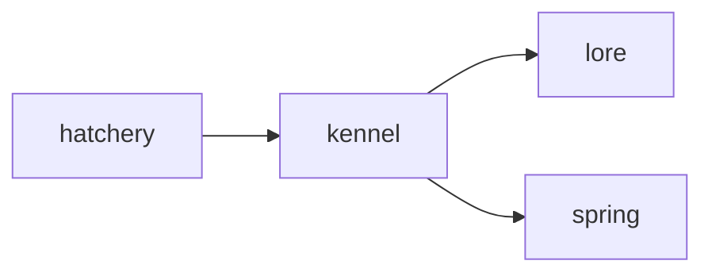

# Kennel

**Breeder Hub** — A planned breeding calculator for previewing legal pairings, traits, and pet lineages.

Part of [ComputerPets](https://github.com/RicheyWorks/computerpets). Map: [computerpets-ecosystem](https://github.com/RicheyWorks/computerpets-ecosystem).

[Status](#status) · [Contract](docs/CONTRACT.md) · [Contributor start](#contributor-start) · [Ecosystem](https://github.com/RicheyWorks/computerpets-ecosystem)

| Project | At a glance |
| --- | --- |
| Status | Design scaffold; not runnable yet |
| License | MIT |
| First pet | [Flagship start guide](https://github.com/RicheyWorks/computerpets/blob/main/docs/START-HERE.md) |

## Status

This repository contains a [contract](docs/CONTRACT.md) and a [source placeholder](src/kennel/index.ts). It has no runnable application, build manifest, automated tests, or CI workflow.

The experience, interfaces, integrations, and safeguards below are **implementation plans**, not supported features. The first implementation slice defines the initial contribution target.

## Planned role

Lineages matter. Kennel shows what two pets can produce, what is canon-illegal (panda × fish), and the rarity of a whelp before anyone mints it.

For the desktop pet, start with the [flagship guide](https://github.com/RicheyWorks/computerpets/blob/main/docs/START-HERE.md).

## Intended audience

Breeders and Hatchery. Calculator, not a slot machine.

## Out of scope

Not a place to invent species. Panda × fish is a documented no.

## Proposed integration



## Planned stack

TypeScript · React 19 · Vite · genetic calculator · Spring lineage API

GroupId / namespace: `com.enterprisepet.kennel`  
Proposed listen surface: `8080`

## Proposed contract

### Data

`Pairing(a, b, legal) · WhelpRow(trait, p) · Lineage(nodes[], coeff)`

### Surface

- POST /v1/predict — two petIds → whelp table + illegal flag
- GET /v1/lineage/{petId} — ancestors, generation, inbreeding coeff
- GET /v1/species-matrix — who can breed with whom

### Planned safeguards

Illegal pair → explain, never invent a hybrid species. Missing parent NFT → mark lineage broken, not 'unknown panda'.

## First implementation slice

Initial implementation target:

**Species matrix page + predict two petIds with illegal flag and whelp table.**

Acceptance targets: Illegal pair explains. Broken lineage marked broken, not 'unknown panda'.

## Planned environment

`VITE_LORE_URL`, `VITE_API_BASE`

Never commit secrets. Never put Steam or chain keys in the overlay.

## Related projects

- [computerpets-lore](https://github.com/RicheyWorks/computerpets-lore)
- [computerpets-minter](https://github.com/RicheyWorks/computerpets-minter)
- [computerpets-ledger](https://github.com/RicheyWorks/computerpets-ledger)
- [computerpets](https://github.com/RicheyWorks/computerpets) Spring pet records

## Layout

```
computerpets-kennel/
  README.md           this file
  LICENSE             MIT
  docs/CONTRACT.md    the same contract, frozen for implementers
  src/                implementation lands here
```

## Contributor start

With Git and PowerShell, clone the scaffold and read its contract and source marker:

```powershell
git clone https://github.com/RicheyWorks/computerpets-kennel.git
Set-Location computerpets-kennel
Get-Content .\docs\CONTRACT.md
Get-Content .\src\kennel\index.ts
```

Start with the [first implementation slice](#first-implementation-slice). Add the minimum project setup and tests needed for that slice, then document verified run commands. The proposed stack above is a design choice; there is no install or launch command for this checkout yet.

## Links

- Flagship: [RicheyWorks/computerpets](https://github.com/RicheyWorks/computerpets)
- This repo: [RicheyWorks/computerpets-kennel](https://github.com/RicheyWorks/computerpets-kennel)
- Map: [RicheyWorks/computerpets-ecosystem](https://github.com/RicheyWorks/computerpets-ecosystem)
- Contract file: [docs/CONTRACT.md](docs/CONTRACT.md)

## License

MIT. See [LICENSE](LICENSE).

---

*Two hundred ten living kinds. Keep them so a line does not go quiet.*
